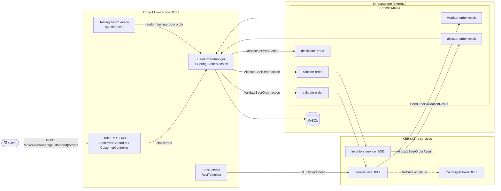

# KBE Brewery — Order Microservice

Spring Boot 4 / Spring Framework 6 order microservice (Java 25). Exposes an order REST API, backed by
MySQL (JPA) and Artemis (JMS), with a state-machine driven order workflow that integrates with the
`kbe-brewery-beer-micro-service` (order validation) and `kbe-brewery-inventory-micro-service`
(inventory allocation) via JMS.

This project is one element of the KBE. See the Gateway Project for a detailed description:
https://github.com/dboeckli/kbe-brewery-gateway/blob/master/README.md

Original git repository: https://github.com/springframeworkguru/kbe-sb-microservices.git

## Architecture Overview



### Role of the services

**kbe-brewery-order-micro-service** (:8081) — the main application. It exposes the order REST API
(Spring Web MVC) for placing, listing and picking up beer orders per customer, backed by MySQL (JPA)
for persistence and Artemis (JMS) for the asynchronous order workflow. Each order is driven through a
Spring State Machine (`BeerOrderStateMachineConfig`, `BeerOrderManagerImpl`) along the lifecycle
`NEW → PENDING_VALIDATION → VALIDATED → PENDING_ALLOCATION → ALLOCATED → PICKED_UP` (terminal:
`CANCELLED`, `VALIDATION_EXCEPTION`, `ALLOCATION_ERROR`, `PENDING_INVENTORY`). The state-machine
actions publish JMS requests (`ValidateBeerOrder` → `validate-order`, `AllocateBeerOrder` →
`allocate-order`, `DeAllocateOrderAction` → `deallocate-order`); the result listeners
(`BeerOrderValidationResultListener`, `BeerOrderAllocationResultListener`) consume the corresponding
result queues and feed them back into the manager. `TastingRoomService` (scheduled) keeps the demo
flow alive by placing a tasting-room order for a random beer.

**beer-service** (`kbe-brewery-beer-micro-service`, :8080) — validates orders against the beer catalog
and serves the beer REST API. The order service calls it with RestTemplate (`BeerServiceImpl`, e.g.
`getListofBeers` used by `TastingRoomService`) and publishes `validate-order` requests to Artemis that
the beer service consumes, replying with `BeerOrderValidationResult` on `validate-order-result`.

**inventory-service** (`kbe-brewery-inventory-micro-service`, :8082) — allocates inventory for orders.
It consumes `allocate-order` requests, performs the full/partial allocation against its MySQL-backed
inventory, and replies with `AllocateBeerOrderResult` on `allocate-order-result` (or `pendingInventory`
when stock runs out). It also consumes `deallocate-order` to free inventory when an allocated order is
cancelled.

**inventory-failover** (`kbe-brewery-inventory-failover`, :8083) — a stateless dummy fallback that is
deployed as part of the stack (Helm dependency, compose service) but not called directly by the order
service. It serves as the fallback for the beer service's inventory lookups: when the beer service's
primary `inventory-service` call fails, it returns a hardcoded inventory (`quantityOnHand: 999`) so the
beer catalog stays functional.

## Deployment

### Deployment with Kubernetes

To run maven filtering for destination target/k8s.

```bash
mvn clean install -DskipTests 
```

Deployment goes into the default namespace.

To deploy all resources:

```bash
kubectl apply -f target/k8s/
```

To remove all resources:

```bash
kubectl delete -f target/k8s/
```

Check

```bash
kubectl get deployments -o wide
kubectl get pods -o wide
```

You can use the actuator rest call to verify via port 30080

### Deployment with Helm

Be aware that we are using a different namespace here (not default).

To run maven filtering for destination target/helm

```bash
mvn clean install -DskipTests 
```

Go to the directory where the tgz file has been created after 'mvn install'

```powershell
cd target/helm/repo
```

unpack

```powershell
$file = Get-ChildItem -Filter kbe-brewery-order-micro-service-v*.tgz | Select-Object -First 1
tar -xvf $file.Name
```

install

```powershell
$APPLICATION_NAME = Get-ChildItem -Directory | Where-Object { $_.LastWriteTime -ge $file.LastWriteTime } | Select-Object -ExpandProperty Name
helm upgrade --install $APPLICATION_NAME ./$APPLICATION_NAME --namespace kbe-brewery-order-micro-service --create-namespace --wait --timeout 5m --debug --render-subchart-notes
```

show logs

```powershell
kubectl get pods -l app.kubernetes.io/name=$APPLICATION_NAME -n kbe-brewery-order-micro-service
```

replace $POD with pods from the command above

```powershell
kubectl logs $POD -n kbe-brewery-order-micro-service --all-containers
```

test

```powershell
helm test $APPLICATION_NAME --namespace kbe-brewery-order-micro-service --logs
```

uninstall

```powershell
helm uninstall $APPLICATION_NAME --namespace kbe-brewery-order-micro-service
```

delete all

```powershell
kubectl delete all --all -n kbe-brewery-order-micro-service
```

create busybox sidecar

```powershell
kubectl run busybox-test --rm -it --image=busybox:1.36 --namespace=kbe-brewery-order-micro-service --command -- sh
```

You can use the actuator rest call to verify via port 30081

## Sandbox (local dev environment)

The sandbox consists of the app (Spring Boot, port 8081) plus MySQL and Artemis (JMS), provided by
`compose.yaml`, together with the sibling services beer, inventory and inventory-failover. The
infrastructure services start automatically via `spring.docker.compose.enabled=true` when the app
boots.

### Start the sandbox (opencode-sandbox-kit)

The sandbox is provisioned by the opencode-sandbox-kit and runs as a Docker container. It mounts this
repo, starts opencode, and connects the IntelliJ MCP server.

Allow the kit source (GitHub without cloning):

```powershell
sbx settings set kit.allowedSources --% "[\"docker.io/\",\"github.com/dboeckli/\"]"
```

Start a new sandbox:

```powershell
sbx run opencode --name kbe-brewery-order-micro-service `
    --static-mcp idea `
    --kit "git+https://github.com/dboeckli/opencode-sandbox-kit.git#dir=opencode-agent" `
    -t docker/sandbox-templates:opencode-docker-0.5.0 `
    "C:\development\projects\kbe-brewery-order-micro-service" `
    "C:\development\maven-repo:ro"
```

Start the sandbox with Kubernetes support:

```powershell
sbx run opencode --name kbe-brewery-order-micro-service `
    --static-mcp idea `
    --kit "git+https://github.com/dboeckli/opencode-sandbox-kit.git#dir=opencode-agent" `
    -t docker/sandbox-templates:opencode-docker-0.5.0 `
    "C:\development\projects\kbe-brewery-order-micro-service" `
    "$env:USERPROFILE\.kube:ro" `
    "C:\development\maven-repo:ro"
```

Apply the kit to an existing sandbox (restarts the sandbox, VM state is kept):

```powershell
sbx kit add kbe-brewery-order-micro-service "git+https://github.com/dboeckli/opencode-sandbox-kit.git#dir=opencode-agent"
```

### Start the app

Run the `BreweryOrderService` run configuration in IntelliJ
(`.run/BreweryOrderService.run.xml`, main class
`ch.dboeckli.springframeworkguru.kbe.order.services.BreweryOrderService`). Alternatively start via
`./mvnw spring-boot:run`.

The compose file brings up:

- `mysql` (port 3306) — database `beerservice`
- `jms` (ports 61616/8161) — Artemis broker + console

### Verify

- Actuator health: http://localhost:8081/actuator/health
- Artemis console: http://localhost:8161/console

## Contributing

Contributions to improve this template are welcome. Please follow the standard GitHub flow:
1. Fork the repository
2. Create a feature branch
3. Commit your changes
4. Push to the branch
5. Create a new Pull Request
